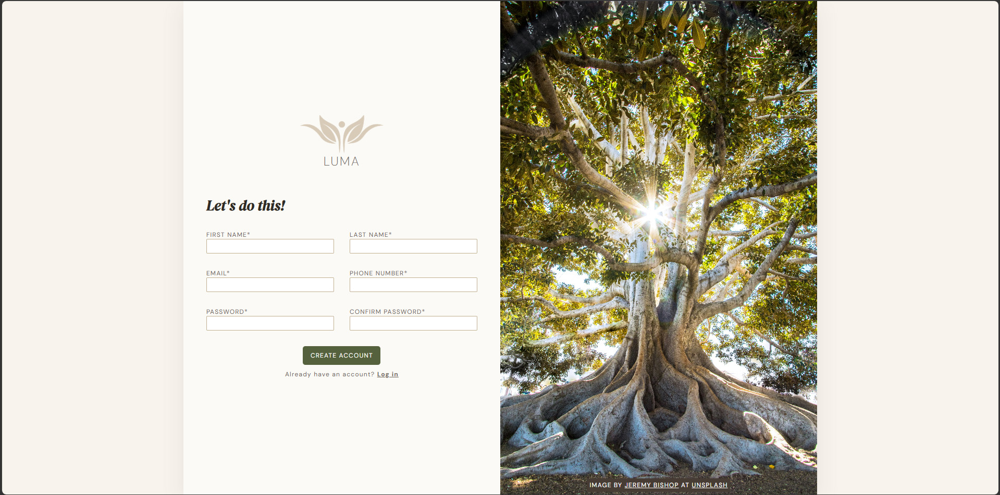

# LUMA — Formulário de Cadastro


> Página de cadastro construída como parte do currículo do [The Odin Project](https://www.theodinproject.com/).

---

## 📸 Preview



---

## 🌿 Sobre o projeto

**LUMA** é uma página de cadastro com visual limpo e minimalista, com layout dividido em duas partes — um painel de formulário à esquerda e um painel fotográfico em altura total à direita. O projeto tem foco em estrutura de formulários HTML e técnicas de layout com CSS.

Crédito da foto: [Jeremy Bishop](https://unsplash.com/@jeremybishop) no [Unsplash](https://unsplash.com/).

---

## ✨ Funcionalidades

- Layout split-screen com Flexbox
- Formulário responsivo em duas colunas com CSS Grid
- Validação nativa do HTML5 com estilização customizada via `:user-invalid`
- Estados de foco e hover para melhor experiência do usuário
- Integração com Google Fonts (DM Sans + DM Serif Display)

---

## 🛠️ Tecnologias utilizadas

- HTML5
- CSS3 (Flexbox, Grid)

---

## 📁 Estrutura do projeto

```
luma/
├── index.html
├── style.css
└── images/
    ├── favicon.png
    ├── logolight.png
    └── treeimage.jpg
```

---

## 📚 O que aprendi

- Estruturar formulários HTML acessíveis com associação correta entre `label` e `input`
- Construir layouts de formulário em duas colunas com CSS Grid
- Usar as pseudo-classes `:user-invalid` e `:focus` para feedback visual

---

## 🚧 Status do projeto

O projeto cobre tudo o que foi pedido pelo curso, mas ainda não está 100% finalizado. As próximas melhorias planejadas são:

- [ ] Toggle de tema claro/escuro (light/dark mode)
- [ ] Validação de senha e confirmação de senha via JavaScript

---

## 🔗 Exercício

Este projeto faz parte do curso **Intermediate HTML and CSS** do [The Odin Project](https://www.theodinproject.com/lessons/node-path-intermediate-html-and-css-sign-up-form).